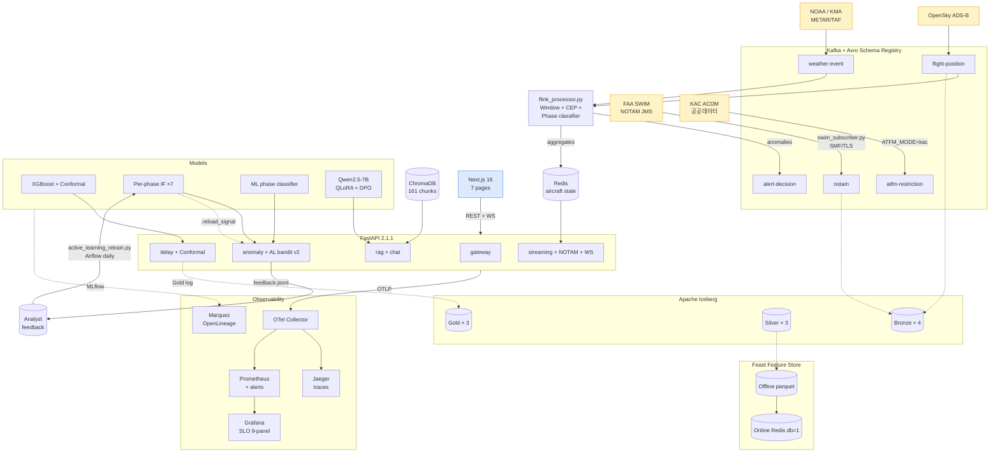

<div align="center">

# ✈️ SkyOps Intelligence

**실시간 항공 운항 이상 탐지 및 AI 관제 보조 플랫폼**

*2026학년도 1학기 캡스톤디자인 → 엔터프라이즈급 운영 플랫폼*

[](https://python.org)
[](https://nextjs.org)
[](https://fastapi.tiangolo.com)
[](https://xgboost.ai)
[](https://huggingface.co/Qwen)
[](https://chromadb.com)
[](https://feast.dev)
[](https://iceberg.apache.org)
[](https://kafka.apache.org)
[](https://www.faa.gov/air_traffic/technology/swim)
[](LICENSE)

</div>

---

## 📌 프로젝트 개요

SkyOps Intelligence는 **항공 관제사를 위한 실시간 AI 파트너**입니다. 캡스톤 MVP (1~15주차) 위에 8회의 엔터프라이즈급 sprint (P0 → P7)를 더해 **production-ready operational intelligence platform**으로 진화했습니다.

- 🛫 **15분 선행 지연 예측** — XGBoost + **Conformal Prediction** (Test R² **0.43**, 90% coverage interval)
- 🚨 **Phase-aware 이상 탐지** — Per-phase Isolation Forest ×7 + **Active Learning 자동 retrain loop**
- 🤖 **자연어 원인 설명** — 항공 도메인 특화 LLM (Qwen2.5-7B QLoRA+DPO) + **RAG 161 chunks**
- 📡 **실시간 NOTAM** — **FAA SWIM 실연동** (Solace SMF/TLS, 60초당 219건 검증)
- 🗺️ **Next.js 16 관제 대시보드** — 항공기 라이브맵 + H3 혼잡도 + **NOTAM 실시간 뷰**
- 📢 **AI 승객 안내문** — 지연 유형별 자동 안내방송문 + **Korean SFT 시드 3000건**

> *"이상을 탐지하고, 원인을 설명하고, 대응 절차를 5초 이내에 자동 생성합니다."*

### 📄 핵심 문서

<table>
<tr>
<td align="center">📚<br><a href="docs/reproduction_guide.md"><b>Reproduction Guide</b></a><br><sub>564라인 · git clone → SWIM live</sub></td>
<td align="center">📊<br><a href="docs/performance_benchmark.md"><b>성능 벤치마크</b></a><br><sub>P0~P7 모든 실측값</sub></td>
<td align="center">🔍<br><a href="docs/limitations_and_improvements.md"><b>한계 및 개선</b></a><br><sub>9대 병목 종결 표</sub></td>
<td align="center">🏛️<br><a href="docs/adr/"><b>ADR (×3)</b></a><br><sub>Service / Gateway / Multi-region</sub></td>
</tr>
<tr>
<td align="center">📐<br><a href="docs/event_model.md"><b>Canonical Event Model</b></a><br><sub>7 이벤트 + Avro v2.0</sub></td>
<td align="center">📋<br><a href="docs/policy_proposal.md"><b>정책 제안서</b></a><br><sub>항공사·공항 도입 3단계</sub></td>
<td align="center">📝<br><a href="docs/final_report.md"><b>최종 리포트</b></a><br><sub>13섹션 · APA 12건</sub></td>
<td align="center">🗄️<br><a href="feature_store/ICEBERG.md"><b>Iceberg Lakehouse</b></a><br><sub>Bronze/Silver/Gold</sub></td>
</tr>
</table>

---

## 🏗️ 시스템 아키텍처 (v2 · P7)



---

## 📊 실측 성능 지표

### 지연 예측 (P0 → P7 진화)

| 지표 | P0 (Capstone) | **P7 (현재)** | 변화 |
|------|---------------|--------------|------|
| Test RMSE | 36.59분 | **28.18분** | -22.8% |
| Test R² | 0.0996 | **0.4328** | **+335%** |
| Val RMSE | 24.64분 | **22.61분** | -8.1% |
| Delay Acc (Test) | 84.16% | **89.04%** | +4.88%p |
| 5-Fold CV std | ±6.14 | **±1.51** | **4× 안정** |
| Conformal coverage | n/a | **90.00%** | (목표 90%) |
| Conformal interval width | n/a | **30.84분** (split) / 33.23분 (CQR) | — |

### 이상 탐지 + LLM

| 모델 | 지표 | 실측값 |
|------|------|--------|
| Per-phase Isolation Forest ×7 | Phase별 contamination tuned | 0.02~0.06 |
| ML Phase Classifier | Heuristic 대비 agreement | **90.3%** |
| Active Learning Loop | feedback → IF retrain | **자동 (Airflow daily 02:00)** |
| AviationLLM (QLoRA) | Eval Token Acc | **97.88%** |
| AviationLLM (DPO) | Rewards Accuracy | **100%** |
| AviationLLM | ROUGE-L / BLEU-1 | 0.169 / 0.121 |
| Korean SFT/DPO 시드 | Pairs 생성 | **3000 SFT + 500 DPO** (next QLoRA 대기) |
| RAG (ChromaDB) | Chunks indexed | **161** (P0 6 → +2583%) |

### 데이터 통합

| 출처 | 통합 상태 |
|------|----------|
| OpenSky ADS-B | ✅ 실시간 (10초 polling) |
| NOAA / KMA METAR | ✅ 실시간 (30분 polling) |
| **FAA SWIM NOTAM** | ✅ **실연동** (Solace SMF/TLS, 60초당 219건 검증) |
| KAC ACDM 공공데이터 | ✅ Client 준비 (Service Key 발급 시 활성화) |
| EUROCONTROL NM B2B | 🟡 P8 (credentials 필요) |

---

## 🚀 Enterprise Upgrade Roadmap (P0 → P7)

> 캡스톤 MVP (1~15주차) 위에 **8회 sprint, 총 45 commits** 로 production-ready 플랫폼으로 진화.

| Sprint | 일자 | 핵심 성과 | Commits |
|--------|------|----------|---------|
| **P0** | 2026-04-14 | TimeSeriesSplit 전환 — 평가 정직화 | 1 |
| **P1** | 2026-04-14 | Conformal Prediction + Canonical Event Model + **Rotation features (Test R² +335%)** | 2 |
| **P2** | 2026-04-14 | ADR-001 Service Decomposition + RAGAs + Phase-aware Anomaly | 3 |
| **P3** | 2026-04-14 | Dashboard re-write + OpenTelemetry + Router 분리 (api.py 1120→107) + Active Learning | 3 |
| **P4+** | 2026-04-15 | Packaging + ADR-002 Traefik + ChromaDB 95 + CQR + Docker/k8s/CI + AL endpoint + ATFM/NOTAM mock | 7 |
| **P5+** | 2026-04-15 | **FAA SWIM 실연동 (219건/60s)** + ML phase + Per-phase IF + Jaeger 로컬 + k8s 검증 + Reproduction Guide | 8 |
| **P6** | 2026-04-15 | **Feast** + **Avro Schema Registry** + AL loop closing + **Iceberg medallion** + Prometheus/Grafana SLO + ChromaDB 161 + Dashboard NOTAM + Makefile | 9 |
| **P7** | 2026-04-15 | **Iceberg writers** + **OpenLineage/Marquez** + AL Bandit v2 + Korean SFT 3500 + KAC ACDM + **Argo Rollouts canary + PSA + NetPol + Trivy** + ADR-003 Multi-region + Reproduction v2 | 9 |

### Strategic Review 9대 병목 종결 상태

| # | 영역 | 종결 상태 |
|---|------|----------|
| 1 | 지연 예측 일반화 | ✅ Test R² 0.4328, CV std 1.51 |
| 2 | Confidence 휴리스틱 | ✅ Conformal split + CQR |
| 3 | 이상 탐지 운영 전 | ✅ Phase-aware + per-phase IF + AL bandit v2 + 자동 retrain |
| 4 | 운항 네트워크 feature | ✅ Rotation × 5 + ATFM (mock+KAC) + NOTAM (실 SWIM) |
| 5 | Data Contract + Lineage | ✅ Avro × 5 + Iceberg medallion + OpenLineage |
| 6 | Feature Store | ✅ Feast (offline parquet + online Redis db=1) |
| 7 | LLM/RAG Governance | ✅ ChromaDB 161 + RAGAs + DPO + Korean SFT 시드 |
| 8 | 서빙 + Observability | ✅ Router 분리 + OTel + Prom/Grafana + Argo Rollouts canary |
| 9 | Engineering Package | ✅ Reproduction v2 + Makefile/tasks.py + ADR×3 + k8s 보안 4겹 |

---

## 🗂️ 디렉토리 구조

```
SkyOps Intelligence/
│
├── 📡 pipeline/                       # Layer 2 · Streaming
│   ├── opensky_producer.py            # ADS-B 실시간 수집
│   ├── metar_producer.py              # METAR 기상 수집
│   ├── flink_processor.py             # PyFlink 5분 윈도우 + CEP
│   ├── cep_rules.py                   # Phase-aware 이상 패턴 룰
│   ├── phase_classifier.py            # FlightPhase heuristic (P2)
│   ├── notam_producer.py              # NOTAM mock + SWIM dispatch (P4+/P5+)
│   ├── swim_subscriber.py             # FAA SWIM Solace SMF subscriber (P5+)
│   ├── atfm_producer.py               # ATFM mock + KAC dispatch (P4+/P7)
│   ├── kac_acdm_client.py             # 한국공항공사 공공데이터 client (P7-E)
│   ├── schema_registry.py             # Confluent SR CLI (P6-B)
│   └── schemas/                       # Avro × 5 .avsc (P6-B)
│
├── 🔬 analysis/                       # ML 학습 + 평가
│   ├── feature_engineering.py         # Rotation features 5종 (P1)
│   ├── xgboost_model.py               # XGBoost + Optuna + OpenLineage (P0/P7-B)
│   ├── conformal_calibration.py       # MAPIE split + CQR (P1/P4+)
│   ├── quantile_regression.py         # GradientBoosting quantile (P4+)
│   ├── ml_phase_classifier.py         # XGBClassifier silver-label (P5+)
│   ├── per_phase_isolation_forest.py  # IF × 7 phases (P5+)
│   ├── active_learning.py             # Feedback 분석 + 권고 (P3)
│   └── active_learning_retrain.py     # 자동 retrain loop (P6-C)
│
├── 🧠 llm_data/                       # LLM 데이터 구축
│   ├── download_liveatc.py
│   ├── transcribe_whisper.py
│   ├── generate_qa_gpt4.py
│   ├── fine_tune_qlora.py             # QLoRA SFT (RTX 3070)
│   └── generate_korean_aviation_corpus.py  # KR SFT/DPO 시드 (P7-D)
│
├── 🎯 dpo/                            # Direct Preference Optimization
│   ├── build_dpo_pairs.py
│   └── train_dpo.py
│
├── 📈 evaluation/                     # 벤치마크 평가
│   ├── build_benchmark.py
│   ├── ragas_bench.py                 # RAGAs + proxy fallback (P2)
│   └── evaluate_model.py
│
├── 🔄 airflow/                        # MLOps 스케줄링
│   └── dags/
│       ├── skyops_retrain_dag.py
│       └── skyops_active_learning_dag.py    # Daily 02:00 UTC (P6-C)
│
├── 📉 monitoring/                     # Observability
│   ├── otel-collector-config.yaml     # OTLP → Jaeger/Prom (P5+)
│   ├── lineage.py                     # OpenLineage emitter (P7-B)
│   ├── prometheus/                    # Scrape + recording + alerts (P6-E)
│   └── grafana/                       # Auto-provisioned 9-panel SLO (P6-E)
│
├── 🚀 serving/                        # FastAPI 2.1.1 (post-ADR-001)
│   ├── api.py                         # Thin entry (107라인)
│   ├── common/
│   │   ├── constants.py
│   │   ├── models.py                  # Pydantic × 12
│   │   ├── model_store.py             # Hot-reload via .reload_signal (P6-C)
│   │   ├── telemetry.py               # OpenTelemetry (P3)
│   │   └── ...
│   └── routers/
│       ├── gateway.py                 # /health × 5 blocks
│       ├── delay.py                   # XGBoost + Conformal + Gold log (P7-A)
│       ├── anomaly.py                 # IF + AL bandit v2 (P7-C)
│       ├── rag.py                     # ChromaDB + vLLM
│       ├── notification.py            # 승객 안내문
│       └── streaming.py               # /aircraft/* + /notam/* + WS (P6-G)
│
├── 🏪 feature_store/                  # Feast + Iceberg (P6-A/P6-D/P7-A)
│   ├── feature_store.yaml
│   ├── entities.py                    # 4 entities
│   ├── feature_views.py               # 4 feature views + 2 services
│   ├── apply.py                       # CLI: register + seed
│   ├── materialize.py                 # Offline → online
│   ├── client.py                      # Serving adapter
│   ├── iceberg_bootstrap.py           # 10 tables (Bronze/Silver/Gold)
│   ├── iceberg_writer.py              # Bronze/Gold writers (P7-A)
│   └── ICEBERG.md                     # Medallion docs
│
├── 🖥️ dashboard/                      # Next.js 16 (App Router)
│   └── src/app/                       # 7 pages
│       ├── page.tsx                   # Overview + KPI
│       ├── map/page.tsx               # Leaflet 라이브맵
│       ├── anomaly/page.tsx           # 이상 피드 + AI 분석
│       ├── notam/page.tsx             # SWIM NOTAM 실시간 (P6-G)
│       ├── predict/page.tsx           # 지연 예측 폼
│       ├── heatmap/page.tsx           # MapLibre H3 히트맵
│       └── chat/page.tsx              # AI 어시스턴트 + RAG
│
├── ☸️ k8s/                            # Kubernetes manifests
│   ├── api-deployment.yaml            # Standard Deployment + HPA
│   ├── ingress.yaml                   # Traefik IngressRoute
│   ├── local/                         # Docker Desktop smoke test (P5+)
│   ├── rollouts/                      # Argo Rollouts canary (P7-F)
│   │   ├── api-rollout.yaml           # 4-step canary 5%→25%→50%→100%
│   │   └── analysis-templates.yaml    # Prometheus AnalysisTemplates
│   └── security/                      # Pod Security + NetworkPolicies (P7-F)
│       ├── namespace-psa.yaml         # restricted profile
│       └── network-policies.yaml      # default-deny zero-trust
│
├── 📄 docs/
│   ├── reproduction_guide.md          # 564라인, P0~P7 전체 (P5+/P7-H)
│   ├── performance_benchmark.md
│   ├── limitations_and_improvements.md
│   ├── policy_proposal.md
│   ├── final_report.md
│   ├── event_model.md                 # 7 canonical events (P1)
│   └── adr/                           # ×3 ADRs (MADR 3.0)
│       ├── ADR-001-service-decomposition.md
│       ├── ADR-002-api-gateway-selection.md
│       └── ADR-003-multi-region-deployment.md
│
├── docker-compose.yml                 # Dev: Kafka + Redis + Schema Registry
├── docker-compose.prod.yml            # Prod: + API + Dashboard + observability + lineage
├── Dockerfile.api / Dockerfile.dashboard
├── pyproject.toml                     # Editable install + 10 entry points + 8 extras
├── Makefile                           # 30 targets (P6-H)
├── tasks.py                           # Cross-platform Python runner (P6-H)
└── README.md                          # 이 파일
```

---

## ⚡ 빠른 시작

### 사전 요구사항

- Python 3.11+, Node.js 20+
- Docker Desktop (Kubernetes 옵션 활성화 권장)
- (선택) CUDA 호환 GPU (vLLM 서빙 시)
- (선택) FAA SWIM 계정 — 실 NOTAM 데이터 수신

### 1. 설치 (한 번에)

```bash
git clone https://github.com/biz-doublej/SkyOps-Intelligence.git
cd SkyOps-Intelligence
git checkout dev
cp .env.example .env                   # SWIM_USERNAME/PASSWORD, KMA_AUTH_KEY 등 채우기

# Python editable install (10 entry points)
pip install -e ".[serving,otel,pipeline,ml,rag,eval,dev]"

# 또는 한 번에 모두
pip install -e ".[all,dev]"

# 검증
python -c "import serving; print(serving.__version__)"   # 2.1.1
skyops-api --help
```

### 2. Makefile / tasks.py로 실행 (가장 쉬움)

```bash
make help                  # Unix/macOS
python tasks.py            # Windows (cross-platform)

# 자주 쓰는 target
make up                    # docker compose up -d (Kafka + Redis + Schema Registry)
make obs                   # +observability profile (Jaeger/Prometheus/Grafana)
make smoke                 # FastAPI in-process smoke test
make swim-trust            # FAA SWIM c_rehash trust store 부트스트랩
make swim                  # SWIM live subscriber
make train-quick           # XGBoost 5 trials (~1m)
```

### 3. 수동 실행 (개별 컴포넌트)

```bash
# 인프라
docker compose up -d

# 데이터 파이프라인
python pipeline/opensky_producer.py     # ADS-B → Kafka
python pipeline/metar_producer.py       # METAR → Kafka
python pipeline/flink_processor.py      # Kafka → Redis + anomaly

# FAA SWIM 실 NOTAM (trust store 셋업 후)
SWIM_TRUSTSTORE_PATH=./data/secrets/swim_trust python pipeline/swim_subscriber.py

# API
OTEL_ENABLED=1 OTEL_OTLP_EXPORTER=1 \
  OTEL_EXPORTER_OTLP_ENDPOINT=http://localhost:4317 \
  skyops-api --port 8000
# Swagger: http://localhost:8000/docs

# Dashboard
cd dashboard && npm install && npm run dev   # http://localhost:3000
```

### 4. P6/P7 Stack 활성화 (선택)

```bash
# Feature Store (Feast)
pip install -e ".[feast]"
python -m feature_store.apply
python -m feature_store.materialize

# Schema Registry (Avro)
pip install -e ".[schema]"
docker compose --profile schema up -d schema-registry
python -m pipeline.schema_registry register-all

# Iceberg lakehouse
pip install -e ".[iceberg]"
python -m feature_store.iceberg_bootstrap
ICEBERG_ENABLED=1 skyops-api --port 8000

# OpenLineage + Marquez
pip install -e ".[lineage]"
docker compose -f docker-compose.prod.yml --profile lineage up -d
OPENLINEAGE_URL=http://localhost:5000 python analysis/xgboost_model.py
# Marquez UI: http://localhost:3000
```

> 자세한 절차 → [`docs/reproduction_guide.md`](docs/reproduction_guide.md) (564라인, 트러블슈팅 10종 포함)

---

## 🔌 API 엔드포인트 (15개)

서버 기동 후 → **`http://localhost:8000/docs`** (Swagger UI)

| 메서드 | 경로 | 설명 | Sprint |
|--------|------|------|--------|
| `GET` | `/health` | 모델 + Feast + Iceberg + Lineage 상태 | P7 |
| `POST` | `/predict/delay` | XGBoost + **Conformal interval** + **Gold log** | P1/P7-A |
| `POST` | `/predict/delay/batch` | 배치 (≤100건) | P0 |
| `POST` | `/detect/anomaly` | **Per-phase IF** + debounce | P2/P5+ |
| `POST` | `/anomaly/feedback` | 분석가 라벨 → feedback.jsonl | P2 |
| `GET` | `/active-learning/next?strategy=` | **Bandit v2 / Uncertainty v1** | P4+/P7-C |
| `POST` | `/chat` | RAG (ChromaDB 161) + vLLM | P2 |
| `POST` | `/explain/anomaly` | LLM 자연어 설명 | P2 |
| `POST` | `/generate/announcement` | 승객 안내문 | P2 |
| `GET` | `/aircraft/live` | Redis 실시간 위치 | P3 |
| `GET` | `/aircraft/h3?resolution=5` | H3 헥사곤 집계 | P3 |
| `GET` | `/anomaly/recent` | 최근 이상 N건 | P3 |
| `GET` | `/notam/recent?location_icao&severity` | **SWIM live + 필터** | P6-G |
| `GET` | `/notam/stats` | 공항별 NOTAM rollup | P6-G |
| `WS` | `/ws/aircraft`, `/ws/anomalies`, `/ws/notams` | 실시간 push | P3/P6-G |
| `GET` | `/metrics` | Prometheus instrumentator | P6-E |

### 사용 예시

```bash
# Health (Feast/Iceberg/Lineage 블록 포함)
curl http://localhost:8000/health | jq

# Conformal prediction (interval 응답)
curl -X POST http://localhost:8000/predict/delay \
  -H "Content-Type: application/json" \
  -d @examples/delay_request.json | jq

# Active Learning Bandit v2
curl 'http://localhost:8000/active-learning/next?strategy=bandit_v2&top_k=10' | jq

# 실 SWIM NOTAM (RKSI 공항 + WARNING 이상)
curl 'http://localhost:8000/notam/recent?location_icao=RKSI&severity=WARNING' | jq

# RAG 채팅
curl -X POST http://localhost:8000/chat \
  -H "Content-Type: application/json" \
  -d '{"question": "RKSI South Flow 운영 시 활주로 배정은?", "use_rag": true}'
```

---

## 🖥️ 대시보드 페이지 (7개)

| 페이지 | 경로 | 기능 |
|--------|------|------|
| 대시보드 개요 | `/` | KPI 4종 + 최근 이상 + 항공기 요약 |
| 실시간 지도 | `/map` | Leaflet 라이브맵 (WebSocket + SWR fallback) |
| 이상 탐지 | `/anomaly` | 실시간 알림 + 심각도 필터 + AI 분석 버튼 |
| **NOTAM (실시간)** | `/notam` | **SWIM 실 데이터 + 4 severity 필터 + top-8 공항 분포 (P6-G)** |
| 지연 예측 | `/predict` | 항공사/공항/Rotation 폼 + Conformal interval 표시 |
| 혼잡도 맵 | `/heatmap` | MapLibre GL H3 R5 히트맵 (5초 갱신) |
| AI 어시스턴트 | `/chat` | RAG 채팅 + 시나리오 3종 + 승객 안내문 사이드패널 |

---

## 🔍 관측성 (Observability)

```bash
docker compose -f docker-compose.prod.yml --profile observability up -d
docker compose -f docker-compose.prod.yml --profile lineage up -d
```

| Tool | URL | 용도 |
|------|-----|------|
| **Jaeger** | http://localhost:16686 | 분산 trace (OTel → OTLP gRPC) |
| **Prometheus** | http://localhost:9090 | 메트릭 + recording rules + alerts |
| **Grafana** | http://localhost:3001 | SLO 9-panel 대시보드 (admin/skyops) |
| **Marquez** | http://localhost:3000 | OpenLineage UI — dataset ↔ model lineage |
| **MLflow** | http://localhost:5000 | 실험 추적 |

### Prometheus 알람 규칙 (자동 평가)
- `ApiHighErrorRate` — 5xx > 1% for 5min
- `DelayLatencyHigh` — `/predict/delay` p95 > 500ms for 10min
- `AnomalyPrecisionDrift` — HIGH severity ratio +15pp from 24h baseline

---

## 🛠️ 기술 스택

| 레이어 | 기술 |
|--------|------|
| **데이터 수집** | OpenSky API · NOAA METAR · **FAA SWIM (Solace SMF/TLS)** · KAC 공공데이터 · Kaggle |
| **스트리밍** | Apache Kafka · **Confluent Schema Registry (Avro)** · PyFlink · Redis |
| **데이터 레이크** | **Apache Iceberg** Bronze/Silver/Gold (medallion) |
| **Feature Store** | **Feast** (offline parquet + online Redis db=1) |
| **ML 모델** | XGBoost + Optuna · Per-phase Isolation Forest ×7 · ML phase classifier · MAPIE Conformal + CQR |
| **LLM** | Qwen2.5-7B-Instruct · QLoRA (TRL) · DPO · Korean SFT/DPO 시드 |
| **LLM 서빙** | vLLM (AWQ 4-bit, awq_marlin) · OpenAI 호환 API |
| **RAG** | LangChain LCEL · ChromaDB (161 chunks) · BAAI/bge-m3 임베딩 |
| **API** | FastAPI 2.1.1 · Pydantic v2 · WebSocket · 6 routers (post-ADR-001) |
| **대시보드** | Next.js 16 App Router · TypeScript · Tailwind · react-leaflet · MapLibre GL |
| **MLOps** | MLflow · Airflow · EvidentlyAI · **OpenLineage + Marquez** · Active Learning loop |
| **관측성** | OpenTelemetry · Jaeger · Prometheus · Grafana SLO 9-panel · 3 alert rules |
| **인프라** | Docker · Docker Compose (5 profiles) · Kubernetes · **Argo Rollouts canary** |
| **보안** | Pod Security Admission `restricted` · NetworkPolicies (zero-trust) · Trivy CI scan · TLS chain |
| **DX** | Editable install (10 entry points · 8 extras) · Makefile · cross-platform tasks.py |

---

## 🏛️ Architecture Decision Records

| ADR | 제목 | 상태 |
|-----|------|------|
| [001](docs/adr/ADR-001-service-decomposition.md) | Service Decomposition (api.py monolith → 6 microservices) | **Accepted** (Phase 1+2) |
| [002](docs/adr/ADR-002-api-gateway-selection.md) | API Gateway — Traefik v3 | **Proposed** |
| [003](docs/adr/ADR-003-multi-region-deployment.md) | Multi-region (KR primary + EU/US read replica) | **Proposed** |

---

## 📅 개발 일지

### Phase 1~3 · 캡스톤 MVP (2026-01 ~ 2026-04)

| 주차 | 완료 내용 | 핵심 산출물 |
|------|-----------|------------|
| 1~4주차 | 시스템 설계 + Kafka 파이프라인 + PyFlink + Feature Engineering | `pipeline/`, `analysis/feature_engineering.py` |
| 5~6주차 | XGBoost + Optuna + SHAP + Isolation Forest | RMSE 24.64분, IF F1 0.345 |
| 7~9주차 | LiveATC STT + ICAO 파싱 + GPT-4 QA + QLoRA + DPO + Airflow | Eval Token Acc 97.88% |
| 10주차 | vLLM AWQ + ChromaDB RAG + FastAPI 완성 | `serving/api.py` |
| 11~12주차 | Next.js 대시보드 6 페이지 + Leaflet + MapLibre H3 + RAG 채팅 | `dashboard/` |
| 13~15주차 | 배포/문서화 + 최종 발표 PPTX | `docs/` 4종 |

### Enterprise Sprint · 2026-04-14 ~ 2026-04-15

| Sprint | 일자 | 주요 변경 |
|--------|------|----------|
| **P0** | 04-14 | TimeSeriesSplit 전환 |
| **P1** | 04-14 | Conformal Prediction + Canonical Event Model + **Rotation features (Test R² +335% 🔥)** |
| **P2** | 04-14 | ADR-001 Service Decomposition + RAGAs + Phase-aware Anomaly |
| **P3** | 04-14 | Dashboard re-write + OpenTelemetry + Router 분리 + Active Learning |
| **P4+** | 04-15 | Packaging + ADR-002 + ChromaDB 95 + CQR + Docker/k8s + AL endpoint + ATFM/NOTAM mock |
| **P5+** | 04-15 | **FAA SWIM 실연동** + ML phase + Per-phase IF + Jaeger + k8s 검증 + Reproduction Guide |
| **P6** | 04-15 | **Feast** + **Avro SR** + AL loop closing + **Iceberg** + Prometheus/Grafana + ChromaDB 161 + Dashboard NOTAM + Makefile |
| **P7** | 04-15 | **Iceberg writers** + **OpenLineage** + Bandit AL v2 + Korean SFT 3500 + KAC ACDM + **Argo Rollouts + PSA + NetPol + Trivy** + ADR-003 + Reproduction v2 |

---

## 🎯 P8 후보 (이연)

- **ATFM real API** — EUROCONTROL NM B2B credentials 필요
- **vLLM tensor parallelism** — multi-GPU 필요
- **LLM Qwen2.5 retrain** — Korean SFT/DPO 시드 ready, GPU 시간 필요
- **Iceberg Silver writers** — feature_engineering.py integration
- **GKE/EKS 실 배포** — 사용자 GCP에서 진행
- **KAC ACDM real API key** — data.go.kr 발급 후 활성화

---

## 👥 팀 + 문의

| 역할 | 이름 |
|------|------|
| 팀장 / 풀스택 | 정재원 |

**지도교수:** 조상구 (빅데이터과)
**학교:** 캡스톤디자인 2026학년도 1학기
**전략 리뷰:** Gabriel (Strategic Review)

---

## 📄 라이선스

MIT License — 학술 목적 자유 사용 가능. 상업적 이용 시 문의.

이 프로젝트는 **공개 데이터**(OpenSky, NOAA, ICAO 공개 자료) 와 **paraphrased corpus** (FAA AIM, ICAO Annex 요약)를 사용합니다. FAA SWIM 데이터는 sub-licensee 계약 범위 내에서만 표시됩니다.

---

<div align="center">

**SkyOps Intelligence** · DoubleJ팀 · 2026

*Built with ❤️ for safer skies — from capstone MVP to enterprise platform in 2 days*

</div>
