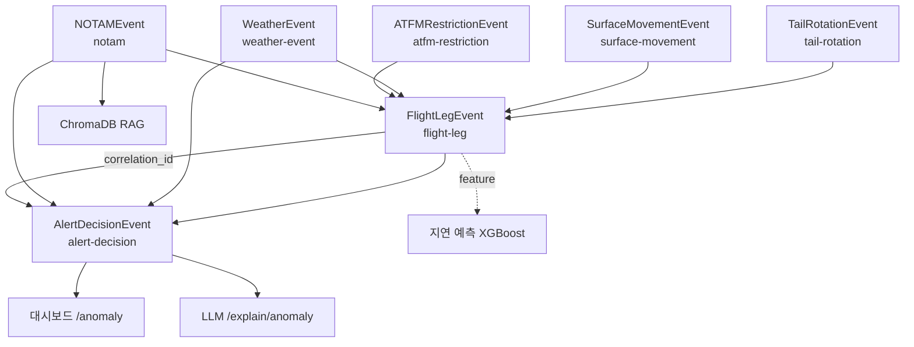

# SkyOps Intelligence — Canonical Event Model

> **작성일**: 2026-04-14
> **버전**: v2.0 (P1 Canonical Event Model — Strategic Review 5번 병목)
> **선행 문서**: `pipeline/schema_doc.md` v1.0 (2주차, flight-position/weather-event 2종 한정)

---

## 0. 개요

SkyOps Intelligence는 현재 `flight-position`과 `weather-event` 두 개의 Kafka 토픽에서 시작해, 이상 탐지·지연 예측·RAG 어시스턴트로 확장된다. 엔터프라이즈급 Airport/Airline/ATC Operations Intelligence Platform으로 체급을 올리기 위해서는, 모든 스트리밍/배치 이벤트가 **Canonical Event Model** — 즉 한 벌의 확장 가능하고 호환 가능한 계약 — 위에서 움직여야 한다.

본 문서는 SkyOps가 앞으로 다룰 **7개 Canonical Event**를 정의한다. 각 이벤트는 현재 상태(✅ 구현 / 🟡 부분 / ❌ 미구현)를 명시하고, 기존 필드와 갭을 비교한다. 이것은 장기 로드맵의 출발점이며, 모든 신규 producer/consumer는 이 문서를 근거로 구현된다.

### 관련 배경
- **EUROCONTROL A-CDM** (Airport Collaborative Decision Making): 공항 이해관계자 간 실시간 데이터 공유와 예측 가능성을 높이기 위한 표준. FlightLegEvent와 TailRotationEvent는 A-CDM 밀스톤에 정렬될 수 있어야 한다.
- **FAA SWIM** (System Wide Information Management): 항공·기상·감시 데이터를 near real-time으로 공유하는 backbone. 본 모델은 SWIM이 퍼블리시하는 메시지 유형을 흡수할 수 있도록 설계된다.

---

## 1. 설계 원칙 · 명명 규칙 · 버전 관리

### 1.1 필드 명명
- **snake_case** 전면 적용 (기존 producer 컨벤션 유지)
- 시간 필드는 `_at` 접미사: `fetched_at`, `observed_at`
- 단위는 필드명에 포함: `altitude_m` (미터), `speed_knots`, `delay_min`
- 불리언은 `is_` / `on_` 접두사: `is_delayed`, `on_ground`

### 1.2 타임스탬프
- 원칙: **UTC + ISO 8601** (RFC 3339 형식): `"2026-04-14T05:00:00Z"`
- 부가: Unix epoch (초 단위) — OpenSky 원본 호환을 위해 `_unix` 접미사 허용
- 타임존은 별도 필드에서 저장하지 않는다 (UTC로 정규화 후, 소비자가 변환)

### 1.3 Null vs Missing
- 필드가 **센서/소스에 없음** → `null`
- 필드가 **스키마에 없음** → 호환성 규칙 따라 추가 (아래 1.4 참조)

### 1.4 스키마 진화 정책
- **MINOR 증가**: 새 optional 필드 추가 (기존 consumer 영향 없음)
- **MAJOR 증가**: 기존 필드 삭제 또는 타입 변경 (consumer 마이그레이션 필요)
- 모든 이벤트는 **`schema_version`** 필드를 포함한다 (`"2.0"`, `"2.1"`, ...)
- 향후 **Confluent Schema Registry** 도입 시 Avro로 자동 변환 (Appendix 참고)

### 1.5 Partition Key 규칙
- 항공기 관련 이벤트: `icao24` 또는 `tail_number`
- 공항 관련 이벤트: `airport_icao`
- 제한/공지 이벤트: `restriction_id` 또는 `notam_id`

### 1.6 토픽 네이밍
- **kebab-case**: `flight-leg`, `weather-event`, `alert-decision`
- Dead-letter 토픽: `<topic>-dlq`
- Schema Registry Subject: `<topic>-value`

---

## 2. Canonical Events (7종)

### 2.1 FlightLegEvent

| 항목 | 내용 |
|------|------|
| **Topic** | `flight-leg` |
| **Status** | 🟡 부분 구현 (현재 `flight-position`으로 ADS-B 위치 스트림만 존재) |
| **Producer** | `pipeline/opensky_producer.py` (향후 `pipeline/flight_leg_producer.py` 분리 예정) |
| **Consumer** | Redis `skyops:aircraft:latest`, Flink aggregator, FastAPI `/aircraft/live` |
| **Purpose** | 항공편 1 leg (출발지 → 도착지)의 생애주기: 스케줄 → off-block → airborne → on-block. A-CDM 밀스톤에 정렬. |

#### Schema

```json
{
  "schema_version": "2.0",
  "event_id": "string (UUID)",              // NEW · 고유 식별자
  "flight_id": "string",                     // NEW · 항공사 내부 flight ID
  "leg_id": "string",                        // NEW · flight_id + sched_dep_time
  "tail_number": "string|null",              // NEW · 기체 등록번호
  "icao24": "string",                        // 기존 · ADS-B 24-bit 주소
  "callsign": "string|null",                 // 기존
  "carrier_code": "string",                  // NEW · IATA/ICAO 항공사 코드 (예: "KE", "KAL")
  "flight_number": "string",                 // NEW · 항공편 번호 (예: "081")
  "origin_icao": "string",                   // NEW
  "destination_icao": "string",              // NEW
  "aircraft_type": "string|null",            // NEW · ICAO 기종 코드 (예: "B789")
  "scheduled_dep_at": "string (ISO 8601)",   // NEW · 스케줄 출발
  "scheduled_arr_at": "string (ISO 8601)",   // NEW · 스케줄 도착
  "actual_dep_at": "string|null",            // NEW · 실제 출발 (off-block)
  "actual_arr_at": "string|null",            // NEW · 실제 도착 (on-block)
  "position": {                              // 기존 flight-position 내용
    "latitude": "float|null",
    "longitude": "float|null",
    "baro_altitude_m": "float|null",
    "geo_altitude_m": "float|null",
    "on_ground": "boolean",
    "velocity_m_s": "float|null",
    "true_track_deg": "float|null",
    "vertical_rate_m_s": "float|null",
    "squawk": "string|null"
  },
  "flight_phase": "string|null",             // NEW · PRE_DEPARTURE|TAXI_OUT|TAKEOFF|CLIMB|CRUISE|DESCENT|APPROACH|LANDING|TAXI_IN|POST_ARRIVAL
  "flight_plan_id": "string|null",           // NEW
  "time_position_unix": "int",               // 기존
  "last_contact_unix": "int",                // 기존
  "fetched_at": "string (ISO 8601)"          // 기존
}
```

#### Current state
- `pipeline/opensky_producer.py` L141-167: `icao24`, `callsign`, `origin_country`, `latitude/longitude`, `baro/geo_altitude`, `on_ground`, `velocity`, `true_track`, `vertical_rate`, `squawk`, `position_source`, `time_position`, `last_contact`, `fetched_at`, `fetched_at_iso`
- Redis: `skyops:aircraft:state:{icao24}` HASH, `skyops:aircraft:latest` ZSET

#### Gap
- `flight_id`, `leg_id`, `tail_number`, `carrier_code`, `flight_number`, `origin_icao`, `destination_icao`, `aircraft_type`, `scheduled_dep_at`, `scheduled_arr_at`, `actual_dep_at`, `actual_arr_at`, `flight_phase`, `flight_plan_id`
- 현재는 순수 ADS-B만 브로드캐스트. Airline schedule 데이터를 OpenSky와 조인해 FlightLegEvent로 승격해야 함.

#### Example (target)
```json
{
  "schema_version": "2.0",
  "event_id": "leg-2026-04-14-KE081-001",
  "flight_id": "KE081-2026-04-14",
  "leg_id": "KE081-2026-04-14-ICN-LAX",
  "tail_number": "HL7645",
  "icao24": "71c007",
  "callsign": "KAL081",
  "carrier_code": "KE",
  "flight_number": "081",
  "origin_icao": "RKSI",
  "destination_icao": "KLAX",
  "aircraft_type": "B789",
  "scheduled_dep_at": "2026-04-14T14:30:00Z",
  "scheduled_arr_at": "2026-04-14T22:15:00Z",
  "actual_dep_at": "2026-04-14T14:47:00Z",
  "actual_arr_at": null,
  "position": {
    "latitude": 37.566,
    "longitude": 126.795,
    "baro_altitude_m": 9448.8,
    "geo_altitude_m": 9432.0,
    "on_ground": false,
    "velocity_m_s": 234.55,
    "true_track_deg": 157.83,
    "vertical_rate_m_s": 14.96,
    "squawk": "2200"
  },
  "flight_phase": "CRUISE",
  "flight_plan_id": "FPL-123456",
  "time_position_unix": 1774024341,
  "last_contact_unix": 1774024341,
  "fetched_at": "2026-04-14T16:32:22Z"
}
```

---

### 2.2 TailRotationEvent

| 항목 | 내용 |
|------|------|
| **Topic** | `tail-rotation` |
| **Status** | ❌ 미구현 (P1 Rotation Features PoC는 배치 학습용 feature로만 도입, 스트리밍 이벤트는 미구현) |
| **Producer** | 향후 `pipeline/tail_rotation_producer.py` (airline schedule DB 또는 A-CDM API 연동) |
| **Consumer** | 지연 예측 모델 feature pipeline, 운영 대시보드 rotation view |
| **Purpose** | 같은 기체(tail_number)의 연속된 leg들을 묶어 turnaround 성과를 추적. EUROCONTROL CODA가 지적하는 **reactionary/rotational delay** 분석의 근간. |

#### Schema

```json
{
  "schema_version": "2.0",
  "event_id": "string (UUID)",
  "tail_number": "string",                    // PK
  "rotation_date": "string (YYYY-MM-DD)",     // 해당 일자
  "rotation_depth": "int",                    // 해당 일자 내 몇 번째 leg (0=첫째)
  "prev_leg_id": "string|null",               // 직전 leg의 leg_id
  "current_leg_id": "string",
  "next_leg_id": "string|null",
  "prev_actual_arr_at": "string|null",        // 직전 leg 실도착
  "current_scheduled_dep_at": "string",
  "current_actual_dep_at": "string|null",
  "scheduled_turnaround_min": "float",        // sched_dep - prev_sched_arr
  "actual_turnaround_min": "float|null",      // act_dep - prev_act_arr
  "turnaround_status": "string",              // ON_SCHEDULE|LATE|EXTENDED_GROUND|CANCELLED
  "is_first_leg_of_day": "boolean",
  "fetched_at": "string (ISO 8601)"
}
```

#### Current state
- 없음. 2026-04-14 P1 PoC에서 feature_engineering.py의 `_add_rotation_features()` 함수로 배치 학습용 feature만 산출.

#### Gap (전체)
- 실시간 스트리밍 이벤트 producer, airline schedule 연동, A-CDM 밀스톤 매핑.

---

### 2.3 SurfaceMovementEvent

| 항목 | 내용 |
|------|------|
| **Topic** | `surface-movement` |
| **Status** | ❌ 미구현 (기존 `gate-event` 토픽은 3주차 목표였으나 실데이터 소스 없어 미구현) |
| **Producer** | 향후 A-SMGCS (Advanced Surface Movement Guidance and Control System) API 또는 공항 AODB 연동 |
| **Consumer** | 활주로 점유율 모니터링, 지상 충돌 탐지, taxi-time 예측 |
| **Purpose** | 공항 지표면 이동 이벤트 — push-back, taxi, 활주로 점유, 게이트 도착. 좁게 보면 gate-event의 확장. |

#### Schema

```json
{
  "schema_version": "2.0",
  "event_id": "string (UUID)",
  "tail_number": "string",
  "icao24": "string",
  "flight_id": "string",
  "airport_icao": "string",
  "movement_type": "string",                  // PUSH_BACK|TAXI_OUT|LINE_UP|TAKEOFF_ROLL|LANDING_ROLL|TAXI_IN|PARKING
  "runway_designator": "string|null",         // "33L", "15R"
  "taxiway_id": "string|null",                // "Charlie"
  "gate_id": "string|null",                   // "101"
  "stand_id": "string|null",                  // "A12"
  "apron_id": "string|null",
  "scheduled_at": "string|null",
  "actual_at": "string (ISO 8601)",
  "duration_sec": "int|null",                 // takeoff_roll, taxi_out_duration 등
  "position": {
    "latitude": "float",
    "longitude": "float"
  }
}
```

#### Gap (전체)
- 국내 공항은 A-SMGCS 데이터 공개하지 않음. OpenSky `on_ground=true` 구간을 heuristic으로 분석해 일부 movement_type 추정 가능 (향후 과제).

---

### 2.4 WeatherEvent

| 항목 | 내용 |
|------|------|
| **Topic** | `weather-event` |
| **Status** | ✅ 구현 완료 (schema_doc.md v1.0과 동일) |
| **Producer** | `pipeline/metar_producer.py` |
| **Consumer** | Flink `skyops:weather:latest:{icao}`, 지연 예측 feature |

#### Schema (기존 유지 + v2.0 확장)

```json
{
  "schema_version": "2.0",
  "event_id": "string (UUID)",                    // NEW
  "source": "NOAA",
  "icao": "string",                               // 기존
  "airport_icao": "string",                       // NEW · icao 필드 표준화 (둘 다 유지)
  "airport_name": "string",                       // 기존
  "observed_at": "string|null",                   // 기존
  "raw_metar": "string|null",                     // 기존
  "wind_direction_deg": "float|null",             // 기존
  "wind_speed_knots": "float|null",               // 기존
  "wind_gust_knots": "float|null",                // 기존
  "wind_shear_altitude_ft": "float|null",         // NEW
  "visibility_m": "float|null",                   // 기존
  "visibility_statute_miles": "float|null",       // NEW (원본)
  "rvr_by_runway": "object|null",                 // NEW · { "33L": 1200, "15R": 800 }
  "temperature_c": "float|null",                  // 기존
  "dewpoint_c": "float|null",                     // 기존
  "altimeter_inhg": "float|null",                 // 기존
  "pressure_hpa": "float|null",                   // 기존
  "ceiling_ft": "float|null",                     // 기존
  "cloud_layers": "array",                        // 기존
  "present_weather": "string|null",               // 기존
  "thunderstorm_active": "boolean",               // NEW
  "hail_active": "boolean",                       // NEW
  "icing_severity": "string|null",                // NEW · LIGHT|MODERATE|SEVERE
  "flight_category": "string|null",               // 기존 (VFR/MVFR/IFR/LIFR)
  "fetched_at": "string (ISO 8601)"               // 기존 fetched_at_iso와 통일
}
```

#### Current state
- `pipeline/metar_producer.py` L131-180: 모든 주요 METAR 필드 파싱 및 발행

#### Gap (minor)
- `rvr_by_runway`, `wind_shear_altitude_ft`, `thunderstorm_active`, `hail_active`, `icing_severity` — METAR RMK 섹션 추가 파싱 필요

---

### 2.5 ATFMRestrictionEvent

| 항목 | 내용 |
|------|------|
| **Topic** | `atfm-restriction` |
| **Status** | ❌ 미구현 (FAA/EUROCONTROL ATFM API 연동 없음) |
| **Producer** | 향후 `pipeline/atfm_producer.py` (EUROCONTROL NM B2B 또는 FAA CSS-Wx) |
| **Consumer** | 지연 예측 feature (`atfm_restriction_active`), 대시보드 영향도 표시 |
| **Purpose** | ATFM (Air Traffic Flow Management) 제약 — Ground Delay Program, 속도 제한, 공역 제한. EUROCONTROL CODA가 지적하는 ATFM delay의 주 원천. |

#### Schema

```json
{
  "schema_version": "2.0",
  "event_id": "string (UUID)",
  "restriction_id": "string",                // PK
  "restriction_type": "string",              // GROUND_DELAY_PROGRAM|DEPARTURE_SLOT|SPEED_RESTRICTION|ALTITUDE_RESTRICTION|REROUTING|CLOSURE
  "affected_airports": ["string"],           // ICAO 배열
  "affected_airspace": ["string"],           // 섹터 ID 배열
  "reason": "string",                        // WEATHER|TRAFFIC_CONGESTION|RUNWAY_CLOSURE|SECURITY|EQUIPMENT_OUTAGE
  "effective_from": "string (ISO 8601)",
  "effective_until": "string (ISO 8601)",
  "expected_duration_min": "int",
  "delay_expectation_min": "int|null",       // 예상 지연
  "issuing_authority": "string",             // FAA|EUROCONTROL|KAC|CAAC
  "initiative_name": "string|null",          // "ZNY GDP 2026-04-14"
  "fetched_at": "string (ISO 8601)"
}
```

---

### 2.6 NOTAMEvent

| 항목 | 내용 |
|------|------|
| **Topic** | `notam` |
| **Status** | ❌ 미구현 (RAG에서 NOTAM 문서는 ChromaDB에 인덱싱되어 있으나 이벤트 스트리밍 없음) |
| **Producer** | 향후 `pipeline/notam_producer.py` (FAA NOTAM API / KAC AIS) |
| **Consumer** | RAG 어시스턴트 검색, 대시보드 공지 피드, 지연 예측 feature |

#### Schema

```json
{
  "schema_version": "2.0",
  "event_id": "string (UUID)",
  "notam_id": "string",                      // 예: "A1234/26"
  "notam_series": "string",                  // A-series (airport), E-series (enroute)
  "issue_date": "string (ISO 8601)",
  "effective_from": "string (ISO 8601)",
  "effective_until": "string (ISO 8601) | null",
  "affected_location": {
    "type": "string",                        // AIRPORT|RUNWAY|TAXIWAY|WAYPOINT|AIRSPACE
    "identifier": "string"
  },
  "notam_class": "string",                   // AD|AS|NAV|COM|FDC (Flight Data Center)
  "traffic_direction": "string",             // INBOUND|OUTBOUND|BOTH|OVERFLIGHT
  "text_raw": "string",
  "text_en": "string",
  "text_ko": "string|null",                  // 한글 번역 (LLM 생성)
  "operational_impact_score": "float|null",  // 0.0~1.0 (LLM 평가)
  "icao_code": "string",                     // 발행 국가
  "fir_code": "string|null",                 // FIR 코드
  "fetched_at": "string (ISO 8601)"
}
```

---

### 2.7 AlertDecisionEvent

| 항목 | 내용 |
|------|------|
| **Topic** | `alert-decision` |
| **Status** | 🟡 부분 구현 (현재 Redis LIST `skyops:anomaly:stream`에만 저장, Kafka 토픽화 미완) |
| **Producer** | `pipeline/cep_rules.py` + Isolation Forest → `pipeline/flink_processor.py` |
| **Consumer** | FastAPI `/anomaly/recent`, WebSocket `/ws/anomalies`, 대시보드 alert feed |
| **Purpose** | CEP 룰 + ML 이상 탐지의 통합 출력. "어떤 이상 신호가 언제 누구에게 트리거되었나"를 추적. |

#### Schema

```json
{
  "schema_version": "2.0",
  "event_id": "string (UUID)",                  // NEW
  "alert_id": "string",                         // NEW · 유일 alert 식별자
  "correlation_id": "string",                   // NEW · 연관 FlightLegEvent.event_id
  "source": "string",                           // NEW · CEP_RULE|ISOLATION_FOREST|ENSEMBLE|PILOT_REPORT
  "rule_id": "string|null",                     // NEW · "ALTITUDE_SPIKE", "VELOCITY_SPIKE", "PATH_DEVIATION"
  "anomaly_type": "string",                     // 기존 (CEP 룰명 유지)
  "severity": "string",                         // LOW|MEDIUM|HIGH|CRITICAL
  "icao24": "string",                           // 기존
  "callsign": "string|null",                    // 기존
  "tail_number": "string|null",                 // NEW
  "flight_phase": "string|null",                // NEW · 1.0에서 상속 (Phase-aware anomaly - P2 로드맵)
  "position": {
    "latitude": "float",
    "longitude": "float",
    "altitude_m": "float",
    "velocity_m_s": "float"
  },
  "detected_at": "string (ISO 8601)",           // 기존 detected_at (Unix ms → ISO 통일)
  "description": "string",                      // 기존
  "details": "object",                          // 기존 (threshold, measurement 등)
  "status": "string",                           // NEW · OPEN|ACKNOWLEDGED|RESOLVED|FALSE_ALARM|SUPPRESSED
  "recommended_action": "string|null",          // NEW · NOTIFY_ATC|REQUEST_PRIORITY|DIVERT|NO_ACTION
  "llm_explanation": "string|null",             // NEW · /explain/anomaly의 결과 (grounded RAG)
  "resolved_at": "string|null"
}
```

#### Current state
- `pipeline/cep_rules.py`의 `AnomalyEvent` dataclass (L32-47): `icao24`, `callsign`, `anomaly_type`, `severity`, `latitude`, `longitude`, `altitude_m`, `velocity_m_s`, `detected_at` (Unix ms), `description`, `details`
- Redis LIST `skyops:anomaly:stream` (최근 1000건)
- FastAPI `/anomaly/recent` → 최근 K건 반환

#### Gap
- `alert_id`, `correlation_id`, `source`, `rule_id`, `tail_number`, `flight_phase`, `status`, `recommended_action`, `llm_explanation`, `resolved_at`
- Kafka topic `alert-decision` 미생성, Redis LIST만 운영 중 → 이벤트 durability 부족 (max 1000건)

---

## 3. 이벤트 간 관계 다이어그램



---

## 4. 스트리밍 규율

### 4.1 Watermark
- 모든 이벤트는 `fetched_at` (또는 `observed_at`) UTC ISO 8601 타임스탬프로 watermark 추출
- Flink `BoundedOutOfOrdernessWatermarkStrategy` 기본 허용 지연: **60초**
- Late arrival 한도를 넘긴 이벤트는 `<topic>-late` 토픽으로 side-output

### 4.2 Idempotent Producer
- Kafka producer는 `enable.idempotence=true` 설정
- 각 이벤트는 `event_id` (UUID)로 유일성 보장
- 소비자는 `event_id` 기준 dedup 가능

### 4.3 Dead-letter 정책
- 스키마 검증 실패 → `<topic>-dlq` 토픽 (본문 원본 + 에러 메시지)
- DLQ 토픽은 7일 retention 후 수동 분석

### 4.4 Exactly-once
- Flink `checkpointingMode=EXACTLY_ONCE`
- Kafka transaction 사용 (`transactional.id` 매 operator 구분)

---

## 5. Schema Registry 도입 로드맵 (Phase 2)

현재는 JSON schema 문서화만 수행. 엔터프라이즈급 전환 시 **Confluent Schema Registry + Avro**로 변환한다.

### 5.1 Subject 명명
- `<topic>-value` (예: `flight-leg-value`)
- Backward compatible 모드 기본 설정

### 5.2 Avro 변환 예시 (FlightLegEvent)

```json
{
  "type": "record",
  "name": "FlightLegEvent",
  "namespace": "com.skyops.events",
  "fields": [
    {"name": "schema_version", "type": "string", "default": "2.0"},
    {"name": "event_id", "type": "string"},
    {"name": "flight_id", "type": "string"},
    {"name": "leg_id", "type": "string"},
    {"name": "tail_number", "type": ["null", "string"], "default": null},
    {"name": "icao24", "type": "string"},
    ...
  ]
}
```

### 5.3 호환성 테스트
CI 파이프라인에서 새 스키마 제출 시 registry `compatibility/test` 엔드포인트로 검증.

---

## 6. 구현 로드맵

| Phase | Event | 목표 기간 | 비고 |
|-------|-------|-----------|------|
| P1 (현재) | Canonical Event Model 문서화 (본 문서) | ✅ 2026-04-14 완료 | — |
| P2 | FlightLegEvent 스키마 확장 + OpenSky와 airline schedule 조인 producer | 2026-05 | 가장 큰 가치 |
| P2 | AlertDecisionEvent Kafka 토픽 분리 + `correlation_id` 연결 | 2026-05 | durability 확보 |
| P3 | TailRotationEvent 실시간 스트리밍 (현재 batch feature는 완료) | 2026-06 | airline schedule 필요 |
| P3 | NOTAMEvent 스트리밍 + RAG auto-indexing | 2026-06 | FAA API |
| P4 | ATFMRestrictionEvent | 2026-07 | EUROCONTROL NM B2B |
| P4 | Confluent Schema Registry 도입 + Avro 변환 | 2026-07 | — |
| P5 | SurfaceMovementEvent (A-SMGCS 또는 heuristic 추출) | 2026-08~ | 국내 공항 데이터 필요 |

---

## 7. 참고

- 선행 문서: `pipeline/schema_doc.md` v1.0 (2주차)
- Strategic Review 5번 병목: `docs/performance_benchmark.md`, [[2026-04-14 Strategic Review]]
- EUROCONTROL A-CDM: https://www.eurocontrol.int/concept/airport-collaborative-decision-making
- EUROCONTROL CODA Q2 2019: https://www.eurocontrol.int/sites/default/files/2019-09/coda-digest_q2-2019.pdf
- FAA SWIM: https://www.faa.gov/air_traffic/technology/swim

---

**다음 수정 시**: `schema_version` 증가 + 변경 이력 CHANGELOG 추가.
