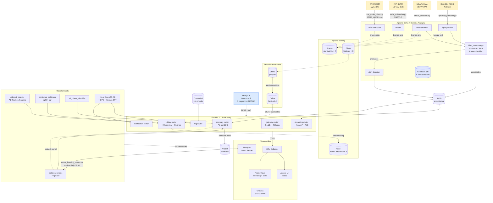

# SkyOps Intelligence — Full Reproduction Guide (P7 · 2026-04-15)

이 문서 한 장으로 **로컬 머신에서 전체 시스템 (FAA SWIM 실연동 포함)을 재현**할 수 있다.
P0 → P5+ 전체 sprint의 결과물을 단일 entry point로 사용하기 위한 가이드.

---

## ✅ 사전 준비

| 항목 | 버전 | 비고 |
|------|------|------|
| Python | 3.11+ | venv 권장 |
| Node.js | 20+ | dashboard용 |
| Docker Desktop | 4.x+ | Kubernetes enable 권장 |
| OpenSSL | 1.1+ | SWIM TLS chain 다운로드 |
| Java (선택) | 21+ | JumpStart Java 백업용 |
| FAA SWIM 계정 | — | https://swim.aim.faa.gov/ NOTAM_Data_Integration 구독 |

```bash
git clone https://github.com/biz-doublej/SkyOps-Intelligence.git
cd SkyOps-Intelligence
git checkout dev
cp .env.example .env
# .env에서 SWIM_USERNAME / SWIM_PASSWORD / KMA_AUTH_KEY 등 채우기
```

---

## 1️⃣ Python 환경 + Editable Install

```bash
python -m venv .venv
source .venv/bin/activate     # Windows: .venv\Scripts\activate
pip install -e ".[serving,otel,pipeline,ml,rag,eval,dev]"
python -c "import serving; print(serving.__version__)"   # 2.1.0
skyops-api --help
```

---

## 2️⃣ Docker Compose Infrastructure

### Dev (Kafka + Redis + Kafka UI)
```bash
docker compose up -d
docker compose ps
# Kafka UI: http://localhost:8080
```

### Production-like (+ API + Dashboard)
```bash
docker compose -f docker-compose.prod.yml up -d
```

### Observability (Jaeger + OTel Collector)
```bash
docker compose -f docker-compose.prod.yml --profile observability up -d
# Jaeger UI: http://localhost:16686
# OTel OTLP: localhost:4317 (gRPC), 4318 (HTTP)
```

---

## 3️⃣ Data Pipeline

### XGBoost 지연 예측 모델 학습 (P0 + P1)
```bash
python analysis/feature_engineering.py     # 5.7M rows → features.parquet
python analysis/prepare_dataset.py         # train/val/test split (temporal)
PYTHONIOENCODING=utf-8 python analysis/xgboost_model.py --trials 30
# → data/models/xgboost_best.pkl (Val RMSE 22.61, Test R² 0.4328)
```

### Conformal Prediction calibration (P1)
```bash
python analysis/conformal_calibration.py --mode split   # symmetric (P1)
python analysis/quantile_regression.py --alpha 0.1      # P4+ CQR prep
python analysis/conformal_calibration.py --mode cqr     # asymmetric (P4+)
```

### ML Phase Classifier (P5+)
```bash
python analysis/ml_phase_classifier.py --n-samples 200000
# → data/models/ml_phase_classifier.pkl (90% agreement vs heuristic)
```

### Per-phase Isolation Forest (P5+)
```bash
python analysis/per_phase_isolation_forest.py --n-samples 30000
# → data/models/isolation_forest_{TAXI,TAKEOFF,...,LANDING}.pkl
```

### ChromaDB RAG 인덱스 (P4+ corpus 95 chunks)
```bash
python serving/04_build_vectordb.py --reset --show-stats
# → data/vectordb/ (95 chunks, BAAI/bge-m3 embeddings)
```

---

## 4️⃣ Streaming Producers (실시간 데이터 수집)

### OpenSky ADS-B (한반도 영공)
```bash
python pipeline/opensky_producer.py        # → Kafka flight-position
```

### NOAA / KMA 기상
```bash
python pipeline/metar_producer.py          # → Kafka weather-event
```

### **FAA SWIM NOTAM (P5+ 실연동)**
```bash
# Trust store 1회 준비
mkdir -p data/secrets/swim_trust
echo | openssl s_client -connect ems2.swim.faa.gov:55443 \
    -servername ems2.swim.faa.gov -showcerts 2>/dev/null \
    > data/secrets/swim_trust/full_chain.pem
csplit -z -f data/secrets/swim_trust/cert_ -b '%02d.pem' \
    data/secrets/swim_trust/full_chain.pem '/-----BEGIN CERTIFICATE-----/' '{*}'
curl -o data/secrets/swim_trust/digicert_g2_root.pem \
    https://cacerts.digicert.com/DigiCertGlobalRootG2.crt.pem
# c_rehash 형식 symlink 생성
for pem in data/secrets/swim_trust/*.pem; do
  hash=$(openssl x509 -in "$pem" -noout -hash 2>/dev/null)
  [ -n "$hash" ] && cp "$pem" "data/secrets/swim_trust/${hash}.0"
done

# 실행
SWIM_TRUSTSTORE_PATH=./data/secrets/swim_trust python pipeline/swim_subscriber.py
# 또는 dispatched via notam_producer
NOTAM_MODE=swim SWIM_TRUSTSTORE_PATH=./data/secrets/swim_trust python pipeline/notam_producer.py
```

### Mock producers (개발 / SWIM 미가용 시)
```bash
ATFM_MODE=mock python pipeline/atfm_producer.py
NOTAM_MODE=mock python pipeline/notam_producer.py
```

### Flink processor (windowing + CEP + phase classification)
```bash
python pipeline/flink_processor.py    # Kafka → Redis aggregation + anomaly detection
```

---

## 5️⃣ Serving (FastAPI)

```bash
# Local
OTEL_ENABLED=1 OTEL_OTLP_EXPORTER=1 \
    OTEL_EXPORTER_OTLP_ENDPOINT=http://localhost:4317 \
    skyops-api --port 8000

# Swagger: http://localhost:8000/docs
```

### Endpoints (전체 13종)

| Endpoint | 기능 | Spec |
|----------|------|------|
| `GET /health` | 헬스 + 모델 가용성 | gateway |
| `POST /predict/delay` | XGBoost + Conformal interval | delay |
| `POST /predict/delay/batch` | 일괄 예측 (≤100건) | delay |
| `POST /detect/anomaly` | IF + phase + debounce | anomaly |
| `POST /anomaly/feedback` | 분석가 라벨 저장 | anomaly |
| `GET /active-learning/next` | Uncertainty sampling queue | anomaly |
| `POST /chat` | RAG (ChromaDB + vLLM) | rag |
| `POST /explain/anomaly` | LLM 자연어 설명 | rag |
| `POST /generate/announcement` | 승객 안내문 | notification |
| `GET /aircraft/live` | Redis 실시간 위치 | streaming |
| `GET /aircraft/h3` | H3 헥사곤 집계 | streaming |
| `GET /anomaly/recent` | 최근 이상 N건 | streaming |
| `WS /ws/aircraft`, `WS /ws/anomalies` | 실시간 push | streaming |

---

## 6️⃣ Dashboard (Next.js 16)

```bash
cd dashboard
npm install
npm run dev
# http://localhost:3000
```

---

## 7️⃣ Kubernetes (Docker Desktop)

### Smoke test
```bash
kubectl apply -f k8s/local/redis-only.yaml
kubectl wait --for=condition=ready pod -n skyops-local -l app=redis --timeout=120s
kubectl run smoke-test --image=redis:7.2-alpine -n skyops-local \
    --restart=Never --rm -i --tty=false --command -- redis-cli -h redis ping
# → PONG
```

### Production manifests (Traefik CRD 필요)
```bash
helm repo add traefik https://helm.traefik.io/traefik
helm install traefik traefik/traefik -n traefik-system --create-namespace
kubectl apply -f k8s/
kubectl get pods -n skyops
```

---

## 8️⃣ Evaluation

### XGBoost benchmark
```bash
cat data/results/xgboost_metrics.csv
```

### Conformal coverage
```bash
python -c "
import pickle
with open('data/models/conformal_calibrator.pkl', 'rb') as f:
    c = pickle.load(f)
print(f\"coverage={c['empirical_coverage']:.2%}, width={c['average_interval_width_min']:.1f} min\")
"
```

### RAGAs benchmark
```bash
skyops-ragas-bench --n 30 --judge proxy
# → data/eval/ragas_results.{json,md}
```

### Active Learning report
```bash
python analysis/active_learning.py
# → data/results/active_learning_report.{json,md}

# Live uncertainty queue (서버 실행 중)
python analysis/active_learning.py next-batch --top-k 20
```

---

## 9️⃣ MLflow Experiment Tracking

```bash
mlflow ui --backend-store-uri ./mlruns --port 5000
# http://localhost:5000
```

---

## 🔟 Smoke Test 전체 (1-shot)

```bash
# Infrastructure
docker compose up -d
docker compose -f docker-compose.prod.yml --profile observability up -d jaeger otel-collector

# Quick API test
OTEL_ENABLED=0 python -c "
from fastapi.testclient import TestClient
import sys; sys.path.insert(0, 'serving')
import importlib.util
spec = importlib.util.spec_from_file_location('api', 'serving/api.py')
mod = importlib.util.module_from_spec(spec); spec.loader.exec_module(mod)
client = TestClient(mod.app)
print(client.get('/health').json())
print(client.get('/active-learning/next?top_k=3').json())
"

# SWIM live test (60s)
SWIM_TRUSTSTORE_PATH=./data/secrets/swim_trust SWIM_RUN_SECONDS=60 \
    python pipeline/swim_subscriber.py
```

기대 결과:
- `/health`: `{status: ok, version: 2.1.0, models: {xgboost: true, ...}}`
- `/active-learning/next`: `{items: [], total_pending: 0, ...}`
- SWIM: `received=200+ published=200+ parse_err=0`

---

## 1️⃣1️⃣ P6/P7 Stack — Feature Store / Schema / Iceberg / Lineage

```bash
# Install P6/P7 extras (optional but recommended for full stack)
pip install -e ".[feast,schema,iceberg,lineage]"

# Feature Store (P6-A) — register + seed
python -m feature_store.apply
python -m feature_store.materialize --lookback-days 7

# Avro Schema Registry (P6-B)
docker compose --profile schema up -d schema-registry
python -m pipeline.schema_registry register-all
python -m pipeline.schema_registry list

# Iceberg Bronze/Silver/Gold (P6-D + P7-A writers)
python -m feature_store.iceberg_bootstrap
ICEBERG_ENABLED=1 skyops-api --port 8000   # /predict/delay logs to Gold

# OpenLineage + Marquez (P7-B)
docker compose -f docker-compose.prod.yml --profile lineage up -d
OPENLINEAGE_URL=http://localhost:5000 python analysis/xgboost_model.py
# Marquez UI: http://localhost:3000

# Active Learning closing loop (P6-C + P7-C bandit)
python -m analysis.active_learning_retrain --dry-run
curl 'http://localhost:8000/active-learning/next?strategy=bandit_v2&top_k=10'

# Korean LLM corpus (P7-D)
python llm_data/generate_korean_aviation_corpus.py --n-sft 3000 --n-dpo 500
cat data/alpaca/korean_aviation_sft.jsonl >> data/alpaca/aviation_alpaca_train.jsonl

# KAC ACDM (P7-E)
KAC_API_KEY=xxx python pipeline/kac_acdm_client.py
ATFM_MODE=kac KAC_API_KEY=xxx python pipeline/atfm_producer.py
```

---

## 1️⃣2️⃣ Production k8s — Argo Rollouts + Security (P7-F)

```bash
# 1. Argo Rollouts controller
helm repo add argo https://argoproj.github.io/argo-helm
helm install argo-rollouts argo/argo-rollouts -n argo-rollouts --create-namespace

# 2. Pod Security restricted profile
kubectl apply -f k8s/security/namespace-psa.yaml

# 3. NetworkPolicies (zero-trust)
kubectl apply -f k8s/security/network-policies.yaml

# 4. Canary rollout
kubectl apply -f k8s/rollouts/

# 5. Watch progressive rollout (5% → 25% → 50% → 100%)
kubectl argo rollouts dashboard
# or
kubectl argo rollouts get rollout skyops-api -n skyops --watch

# Promote / abort manually
kubectl argo rollouts promote skyops-api -n skyops
kubectl argo rollouts abort   skyops-api -n skyops
```

---

## 📐 Architecture Diagram (v2 · P7)



### What changed in v2 (vs v1 P5+)

| Layer | v1 (P5+) | v2 (P7) |
|-------|---------|---------|
| Schema | event_model.md prose | **5 Avro + Confluent SR** (BACKWARD compat) |
| Lineage | none | **Iceberg medallion + Marquez OL** |
| Feature governance | scattered | **Feast** (offline parquet + online Redis db=1) |
| Active learning | manual | **closed loop** (Airflow daily, hot-reload) |
| Observability | Jaeger only | **+ Prometheus + Grafana + 3 alerts** |
| RAG | 95 chunks | **161 chunks + KR specific** |
| Dashboard | 6 pages | **7 pages incl. NOTAM live** |
| ATFM | mock only | **mock + KAC public-data** |
| LLM | English-bias | **+3000 KR SFT + 500 DPO pairs ready** |
| k8s | basic Deployment | **Argo Rollouts canary + PSA + NetPol + Trivy** |

---

## 📚 관련 문서 인덱스

| 문서 | 위치 |
|------|------|
| 최상위 README | `README.md` |
| Canonical Event Model | `docs/event_model.md` |
| Avro schemas (P6-B) | `pipeline/schemas/README.md` |
| Iceberg medallion (P6-D + P7-A) | `feature_store/ICEBERG.md` |
| k8s Security bundle (P7-F) | `k8s/security/README.md` |
| Performance Benchmark | `docs/performance_benchmark.md` |
| Limitations & Improvements | `docs/limitations_and_improvements.md` |
| ADR-001 Service Decomposition | `docs/adr/ADR-001-service-decomposition.md` |
| ADR-002 API Gateway (Traefik) | `docs/adr/ADR-002-api-gateway-selection.md` |
| ADR-003 Multi-region (P7-G) | `docs/adr/ADR-003-multi-region-deployment.md` |
| Final report (week14) | `docs/final_report.md` |
| Strategic Review 2026-04-14 | (Notion + Obsidian) |
| Makefile / tasks.py (P6-H) | `Makefile`, `tasks.py` |
| Reproduction Guide (이 문서) | `docs/reproduction_guide.md` |

---

## 🚀 Sprint Commit History (P0 ~ P7)

| Sprint | Commits | 핵심 변경 |
|--------|---------|----------|
| P0 | `b5b41c3` | TimeSeriesSplit 전환 |
| P1 | `2863be8`, `cb3798c` | Conformal + Event Model + Rotation features (Test R² +335%) |
| P2 | `3451269`, `df50fca`, `887bf1e` | ADR-001 + RAGAs + Phase-aware anomaly |
| P3 | `e00a10b`, `5e32ee5`, `99807fc` | Dashboard README + OTel + router 분리 + Active Learning |
| P4+ | `8a3ac43`, `c1854cb`, `c7508d7`, `83e4276`, `4f16c46`, `1318676`, `c7c3cf6` | Packaging + ADR-002 + ChromaDB + CQR + Docker/k8s/CI + AL endpoint + ATFM/NOTAM mock |
| P5+ | `7d93872`, `4249820`, `7c80b2b`, `b4bcd44`, `9ed8498`, `6ec6e15`, `06e8ee3`, `7189a24` | **FAA SWIM real (219 NOTAMs/60s)** + ML phase + Per-phase IF + Jaeger + k8s 실배포 + Reproduction guide |
| P6 | `69bfa9c`, `2a2bc74`, `5062fe6`, `f645230`, `7df64d1`, `63cf9cf`, `1aec5ba`, `ea14089`, `1ee975b` | **Feast + Avro SR + AL loop closing + Iceberg + Prom/Grafana + ChromaDB 161 + Dashboard NOTAM + Makefile** |
| P7 | `bfafa8a`, `62734cf`, `e660bf4`, `4b00f17`, `2bafabd`, `dd0868c`, `f229927`, ... | **Iceberg writers + OpenLineage + Bandit AL v2 + KR SFT/DPO + KAC ACDM + Argo Rollouts/PSA/NetPol + ADR-003 multi-region** |

---

## ⚠️ Troubleshooting

### SWIM 연결 실패 (`SOLCLIENT_SUBCODE_UNTRUSTED_CERTIFICATE`)
- DigiCert Global Root G2 가 trust store에 없음
- 위 §4 SWIM 섹션의 `data/secrets/swim_trust/` 셋업 단계 다시 실행

### `pip install -e .` 실패 (Windows)
- Microsoft C++ Build Tools 설치 필요 (xgboost wheel)
- 또는 `conda install xgboost` 후 `pip install -e . --no-deps`

### Kafka `NoBrokersAvailable`
- `docker compose up -d` 누락
- WSL2 백엔드 비활성화 시 Docker Desktop 재시작

### Jaeger UI 접속 안됨
- `docker compose -f docker-compose.prod.yml --profile observability ps`
- 포트 16686 점유 확인

### Solace Python `Failed to load trust store`
- TRUST_STORE_PATH가 디렉토리여야 함 (단일 PEM 파일 아님)
- `c_rehash` 형식 (`{hash}.0`) 파일이 디렉토리 안에 있어야 함

### Feast `feast apply` 실패 — Redis 미연결
- `docker compose up -d` 로 Redis 띄움
- `feature_store.yaml` 의 connection_string `localhost:6379,db=1`이 conflict 시 변경

### Iceberg `pyiceberg.exceptions.NamespaceAlreadyExistsError`
- 정상 동작 — 두번째 `python -m feature_store.iceberg_bootstrap` 실행 시 namespace 가 이미 있음을 알림

### Marquez UI 응답 없음
- Postgres 초기화 30~60s 소요 — `docker compose -f docker-compose.prod.yml --profile lineage logs marquez` 확인
- 포트 5000 충돌 (다른 dev server 와) — `marquez:` 의 ports 매핑 변경

### NetworkPolicy 무시됨
- CNI 가 NetworkPolicy 미지원 (e.g. plain flannel)
- Calico/Cilium/Weave 설치 필요. Docker Desktop k8s 는 Calico 가 가장 단순:
  ```bash
  curl https://raw.githubusercontent.com/projectcalico/calico/v3.27.0/manifests/tigera-operator.yaml | kubectl apply -f -
  ```

### Argo Rollouts canary 가 시작하지 않음
- `kubectl get rollout skyops-api -n skyops -o yaml` 에 paused 상태 확인
- AnalysisTemplate 의 Prometheus address `http://prometheus.skyops:9090` 이 해석 가능한지 확인
- `kubectl argo rollouts dashboard` 로 시각적 디버깅
